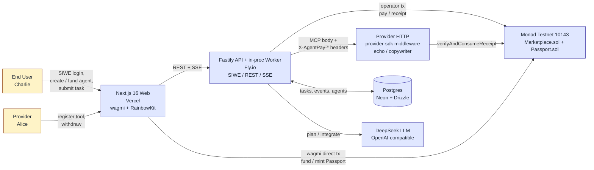

# mapay · AgentPay Passport

> **A2A lets agents talk. AgentPay Passport lets agents transact.**
>
> 给 AI agent 一笔链上预算,它自己跑去全网 AI 服务市场买工具、做活、交付——你只发指令和验收,越用越懂你。

[](https://soliditylang.org/)
[](https://book.getfoundry.sh/)
[](https://nextjs.org/)
[](https://docs.monad.xyz/)
[](https://www.monad.xyz/)

AgentPay Passport is a **Monad-native paid AI service marketplace** for autonomous AI agents. Providers list MCP-compatible paid tools; End Users fund a Buyer Agent with a hard on-chain budget and ship intents; the agent discovers, pays, and orchestrates without any human in the loop. Submitted to **Monad Blitz @ Shanghai V2**.

**Pitch:** *AgentPay Passport is MPP-aligned. MPP standardized how an agent pays. We added what the agent decides, where it discovers, and how it remembers.*

---

## 🚀 Try It

| | |
|---|---|
| **Live (frontend, mock data)** | https://mapay-chi.vercel.app |
| **Repo** | https://github.com/huaruic/mapay |

> The live build runs the mock-data UI flow end-to-end (agent creation → task submission → timeline → receipts → rating). On-chain wiring lands once the contracts ship to Monad testnet.

---

## The Problem

Every AI agent on the wire today is locked into a single provider's economic graph. Agents can *talk* via A2A and MCP, but the moment they need to *pay* for an external capability they fall back to one of three legacy options: a hard-coded API key, a human-in-the-loop checkout, or an opaque platform credit balance. None of these scale to autonomous, budgeted, multi-provider agents — and none of them produce a portable reputation the agent owns across marketplaces.

## The Solution

Three protocol layers on top of [MPP](https://docs.monad.xyz/) (the Monad Machine Payments Protocol; x402 is its early form) — all enforced at the contract level so an adversarial LLM cannot bypass them:

1. **Onchain Marketplace Discovery** — Providers `registerTool(endpoint, schemaHash, pricePerCall, ...)`. Permissionless register, permissionless consume, no gatekeeper. MVP shows the full list with no search/filter/sort (PRD §10) so agents must read the manifest, not the UI.
2. **Policy-Bounded Agent Wallet** — End Users mint a Buyer Agent with `totalBudget`, `maxPerCall`, and `dailySpendCap`. The check lives inside `Marketplace.pay()` as `require()` — prompt injection cannot drain it.
3. **ERC-8004 Reputation Passport** — Each Buyer Agent gets a **soulbound ERC-721** that records task history hashes and aggregated star ratings. Implements the ERC-8004 (Trustless Agents) surface (`agentScore`, `agentMetadata`, `tokenIdOf`) so other marketplaces can read the same passport.

Provider ↔ End User pseudonymity holds throughout: they only ever see each other through tool IDs and agent addresses.

---

## Architecture



Three roles, four moving systems:

- **End User (Charlie)** signs in with SIWE, creates a Buyer Agent, sets a budget envelope, submits a natural-language task, and watches the timeline. The only signatures they ever produce are: create agent, fund agent, mint Passport, withdraw, rate.
- **Provider (Alice)** registers a paid tool (endpoint + MCP schema + price), monitors revenue, withdraws via pull-payment. Never directly contacted by End Users.
- **Buyer Agent** is a software actor running inside the API worker: plans once, executes open-loop, pays under protocol-enforced budget. Multi-turn refinement creates a *new* task that links to its parent via `parent_task_id` — each task is still plan-once-execute (PRD §10).

The API and the Worker live in **one Fastify process** (`api/src/{routes,worker}`) — a Fly.io deploy is one VM, not two. Splitting them is a config change later.

---

## Status

> Source of truth is the file tree + tests, not this table.

| Module | Status | Evidence |
|---|---|---|
| Product PRD | ✅ Complete | `agentpay-passport-prd.md` |
| Architecture spec | ✅ Complete | `docs/superpowers/specs/2026-05-12-agentpay-architecture-design.md` (781 lines) |
| OpenSpec proposal #1 | ✅ Validated | `openspec/changes/add-marketplace-and-provider-onboarding/` |
| Solidity contracts | ✅ Implemented + tested | `Marketplace.sol` (456 loc), `Passport.sol` (187 loc); **8 Foundry test contracts** |
| Provider SDK | ✅ Implemented + tested | `provider-sdk/` — Fastify plugin, 1 vitest |
| Reference Provider — echo | ✅ Implemented + tested | `echo-provider/` |
| Reference Provider — copywriter | ✅ Implemented + tested | `copywriter-provider/` — real DeepSeek-backed tool, 2 vitests |
| Backend API + Worker | ✅ Implemented + tested | `api/` — 6 routes, in-proc worker, chain watcher, SSE, LLM provider; **9 vitests** |
| Frontend UI | ✅ Routes complete (mock data) | `app/` — 9 pages, wagmi/RainbowKit configured; **9 vitests** |
| Local Anvil deploy | ✅ Scripted | `contracts/scripts/deploy-local.sh` |
| Monad testnet deploy | ❌ Not yet | Addresses still `0x0…` in `lib/abi/addresses.example.json` |
| Production hosting | 🚧 Vercel only | API/providers not on Fly.io yet; plan in `docs/deployment.md` |
| Wagmi wiring into pages | 🚧 Pending | Frontend currently reads `lib/mock-data.ts` |

**Test totals: 22 TypeScript test files (vitest) + 8 Foundry test contracts.**

---

## Tech Stack

| Layer | Choice |
|---|---|
| Chain | Monad testnet (chain id `10143`, native `MON`) |
| Contracts | Solidity 0.8.20 + Foundry + OpenZeppelin v5 + `via_ir` + Cancun EVM |
| Passport NFT | **Soulbound ERC-721 + ERC-8004 compatible** (cross-marketplace reputation) |
| Backend | Node 22 + TS + Fastify + viem v2 + SIWE + JWT + BullMQ (Upstash Redis opt-in) |
| Worker | In-process (same Fastify app) — toggles to BullMQ when `REDIS_URL` is set |
| DB | Postgres (Neon) + Drizzle ORM |
| LLM | DeepSeek default (OpenAI-compatible); `LLMProvider` abstraction for Claude/GPT |
| Frontend | Next.js 16 + React 19 + Tailwind v4 + wagmi v2 + RainbowKit + TanStack Query + Zustand + react-hook-form + zod + lucide-react |
| Repo layout | **Flat** — `app/` `components/` `lib/` `contracts/` `api/` `provider-sdk/` `echo-provider/` `copywriter-provider/`. No pnpm workspaces / Turbo for hackathon scope. |
| Hosting target | Vercel (web) + Fly.io (api + providers) + Neon (db) + Upstash (redis, optional) + Pinata (IPFS schema) |

Full decision log: [`openspec/config.yaml`](./openspec/config.yaml).

---

## Frontend Routes

| Path | Purpose |
|---|---|
| `/` | Landing |
| `/marketplace` | Public tool list — full table, no search/filter/sort (PRD §10) |
| `/marketplace/[toolId]` | Tool detail: manifest, MCP schema, on-chain receipts |
| `/agents` | My Buyer Agents |
| `/agents/new` | Create + fund a Buyer Agent |
| `/agents/[agentId]` | Agent workspace — three-pane timeline (demo core) |
| `/agents/[agentId]/new-task` | Submit a task |
| `/provider` | Provider console: tools, revenue, withdraw |
| `/provider/tools/new` | Register a paid tool |
| `/tasks/[taskId]` | Public task audit view — third parties can reconstruct the full on-chain trace |

---

## Contract Interface

Selected functions from `contracts/src/Marketplace.sol` and `Passport.sol`. Full surface in the source.

| Function | Caller | Purpose |
|---|---|---|
| `registerTool(endpoint, schemaHash, pricePerCall, name, desc, payout)` | Provider | Append-only tool listing; emits `ToolRegistered` |
| `setToolEnabled(toolId, enabled)` / `setToolPrice` / `setToolVersion` | Provider | Pause / reprice / bump schema version (history preserved) |
| `createAgent(operator, maxPerCall, dailyCap, totalBudget)` | End User | Spawn a Buyer Agent + mint its soulbound Passport |
| `fundAgent(agentId)` (payable) | End User | Top up `agent.balance` in MON |
| `pay(agentId, toolId, inputHash, step)` | Operator | Protocol-level budget check + receipt mint; credits provider ledger |
| `verifyAndConsumeReceipt(receiptId, inputHash)` | Provider | Atomic verify + consume in a single tx — closes TOCTOU between gate and handler |
| `withdrawProvider(toolId)` | Provider | Pull-payment withdraw of accrued revenue |
| `rateTask(agentId, taskId, stars)` | End User | 1–5 star rating; updates `Passport.reputation` |
| `agentScore(tokenId)` / `agentMetadata(tokenId)` / `tokenIdOf(agentId)` | Anyone | ERC-8004 reputation reads (no other marketplace need depend on this repo) |

Provider call protocol: HTTP `POST /invoke` with MCP-style body and **5 protocol headers** — `X-AgentPay-Receipt`, `X-AgentPay-Agent-Id`, `X-AgentPay-Tool-Id`, `X-AgentPay-Step`, `X-AgentPay-Input-Hash`. The `@agentpay/provider-middleware` Fastify plugin handles re-hashing + `verifyAndConsumeReceipt` + `402 Payment Required` fallback (MPP/x402-compatible). See [`provider-sdk/src/index.ts`](./provider-sdk/src/index.ts).

---

## Local Development

Node 22+. Foundry on `$PATH` (`curl -L https://foundry.paradigm.xyz | bash && foundryup`).

### Frontend

```bash
npm install
npm run dev        # http://localhost:3000
npm run lint       # tsc --noEmit
npm test           # vitest run
```

Optional: `cp .env.example .env.local` and set `NEXT_PUBLIC_WALLETCONNECT_PROJECT_ID` (from https://cloud.reown.com — free for testnet) for RainbowKit.

### Contracts (Foundry)

```bash
cd contracts
forge build
forge test                # 8 test contracts
npm run deploy:local      # starts Anvil + deploys + writes lib/abi/addresses.local.json
```

`deploy:local` is idempotent: skips re-launching `anvil` if `127.0.0.1:8545` already responds with a real JSON-RPC.

### Backend API

```bash
cd api
npm install
cp .env.example .env      # PORT, JWT_SECRET, DATABASE_URL, ...
npm run dev               # tsx watch — http://localhost:4000
npm test                  # 9 vitests
```

The worker starts automatically when both `OPERATOR_PK` and `MARKETPLACE_ADDRESS` are set; otherwise the API falls back to the mock-worker timer baked into `routes/tasks.ts`.

### Reference providers

```bash
# Echo (smoke-tests the protocol)
cd echo-provider && npm install && cp .env.example .env && npm start

# Copywriter (real DeepSeek-backed paid tool)
cd copywriter-provider && npm install && cp .env.example .env && npm start
```

Each provider runs on its own port (default `4100` / `4101`) and refuses any call without a valid receipt — try `curl` without headers and you'll get `402 Payment Required`.

---

## Testing

```bash
npm run test:all          # contracts (forge) + api (vitest) + web (vitest)

# Targeted:
npm run test:contracts    # forge test inside contracts/
npm run test:api          # vitest inside api/
npm run test:web          # vitest at repo root (frontend)
```

| Suite | Count | What it covers |
|---|---|---|
| **Foundry tests** | 8 contracts | `Marketplace_*`: access control, daily cap, pull-payment, receipt atomicity, register-tool, tool-version; `Passport_Soulbound`: transfer-disabled invariants |
| **API vitest** | 9 files | SIWE auth flow, marketplace routes, agents/tasks lifecycle, server boot, operator-key crypto, chain wallet, worker integration (LLM + runTask + queue) |
| **Provider SDK vitest** | 1 file | Receipt validation + 402 fallback |
| **Echo provider vitest** | 1 file | End-to-end through the middleware |
| **Copywriter provider vitest** | 2 files | Unit + integration against the DeepSeek schema |
| **Frontend vitest** | 9 files | Page-level rendering, agent-workspace timeline, agents-list, provider page banner |

---

## Project Structure

```
mapay/
├── app/                          # Next.js 16 App Router
│   ├── page.tsx                  # /
│   ├── marketplace/, agents/, provider/, tasks/
│   └── layout.tsx                # wagmi/RainbowKit providers
├── components/                   # Shared UI primitives (AppShell, Metric, Field, …)
├── lib/                          # mock-data, wagmi config, chain config, SSE client, abi/
├── contracts/                    # Foundry workspace
│   ├── src/Marketplace.sol       # ToolRegistry + AgentRegistry + AgentWallet + PaymentEscrow
│   ├── src/Passport.sol          # Soulbound ERC-721 + ERC-8004 surface
│   ├── test/                     # 8 Foundry test contracts
│   └── scripts/deploy-local.sh   # Anvil + ABI sync
├── api/                          # Fastify + Drizzle + viem + SIWE + JWT
│   ├── src/routes/               # auth, marketplace, agents, tasks, provider, health
│   ├── src/chain/                # client, wallet (operator), watcher (event subscription)
│   ├── src/worker/               # queue (in-mem / BullMQ), runTask, llm, sse, chain, db, http
│   ├── src/db/, src/lib/         # store, env, auth-guard, operator-key-crypto, mock-tools
│   └── drizzle/                  # 0000_init.sql + snapshots
├── provider-sdk/                 # @agentpay/provider-middleware (Fastify plugin)
├── echo-provider/                # Reference: minimal echo handler
├── copywriter-provider/          # Reference: DeepSeek-backed paid tool
├── docs/                         # Architecture spec, deployment runbook
├── openspec/                     # Spec-driven change proposals
├── scripts/                      # sync-abi (forge → lib/abi/*.ts)
└── test/                         # Frontend vitest (page-level)
```

---

## Non-Negotiable Product Constraints

These are protocol-shaping decisions, not preferences. Code that violates them gets reverted.

- **No human in the loop during execution.** End User signs only to create agent / fund / mint Passport / withdraw / rate. Everything between "Submit Task" and "Result Ready" is autonomous.
- **Budget enforcement is protocol-level.** `require()` inside `Marketplace.pay()` — LLM cannot bypass.
- **Provider ↔ End User pseudonymity.** They interact only through the protocol surface. No PII anywhere.
- **MCP-compatible tool schema + on-chain payment gate.** The only protocol extension over MCP is the pre-call receipt handshake (MPP/x402 style).
- **Open-loop planning only.** One plan per task. Multi-turn = a child task via `parent_task_id` — each task is still plan-once-execute.
- **Marketplace ships the full list — no search, filter, or sort.** Agents read the manifest.
- **Single chain (Monad).** No bridges, no multi-chain abstraction.
- **No dispute, refund, KYC, or moderation.**

---

## Documentation

- [`agentpay-passport-prd.md`](./agentpay-passport-prd.md) — product requirements (authoritative)
- [`docs/superpowers/specs/2026-05-12-agentpay-architecture-design.md`](./docs/superpowers/specs/2026-05-12-agentpay-architecture-design.md) — architecture spec (post hybrid-review)
- [`docs/deployment.md`](./docs/deployment.md) — testnet + production deployment runbook
- [`openspec/config.yaml`](./openspec/config.yaml) — locked tech decisions
- [`openspec/changes/`](./openspec/changes/) — spec-driven change proposals
- [`CLAUDE.md`](./CLAUDE.md) — project navigation for AI coding agents
- [`AGENTS.md`](./AGENTS.md) — Codex-side mirror of CLAUDE.md

---

## License

No `LICENSE` file yet — treat the code as "all rights reserved" pending a decision on license.

## Acknowledgments

- [**Monad**](https://www.monad.xyz/) — testnet, faucet, and the MPP/x402 protocol direction.
- [**OpenZeppelin v5**](https://www.openzeppelin.com/contracts) — ERC-721, ReentrancyGuard.
- [**Foundry**](https://book.getfoundry.sh/) — `forge` + `cast` + `anvil`.
- [**viem**](https://viem.sh/), [**wagmi**](https://wagmi.sh/), [**RainbowKit**](https://www.rainbowkit.com/) — TypeScript Ethereum stack.
- [**DeepSeek**](https://platform.deepseek.com/) — OpenAI-compatible LLM used by the Buyer Agent and the copywriter provider.
